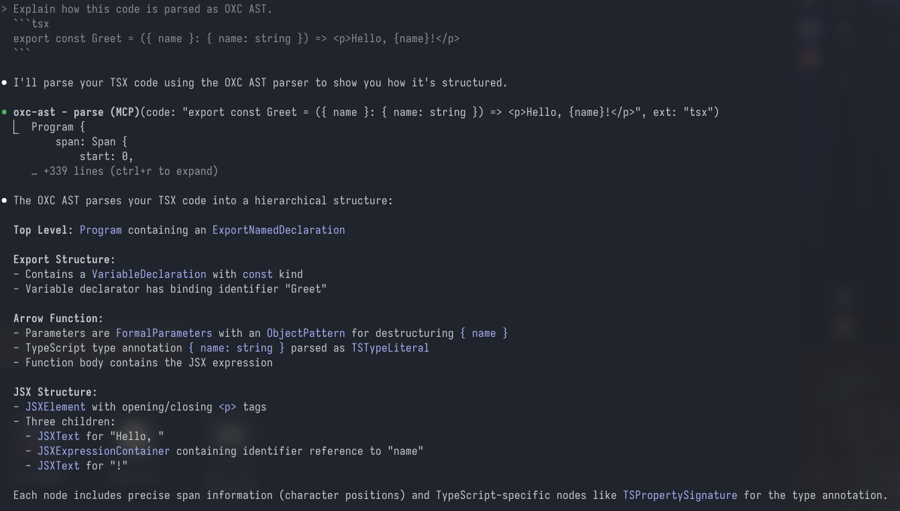
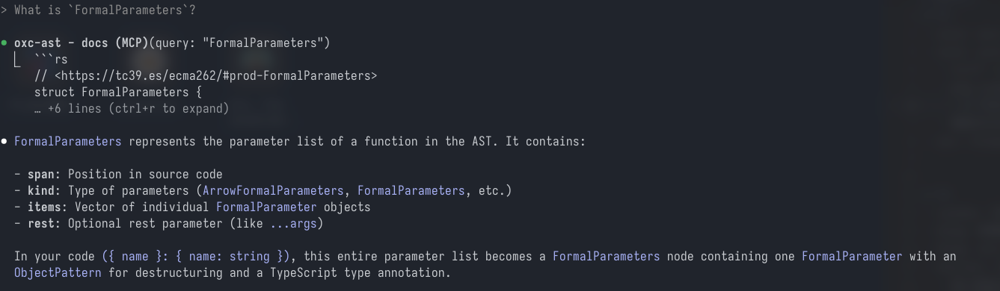
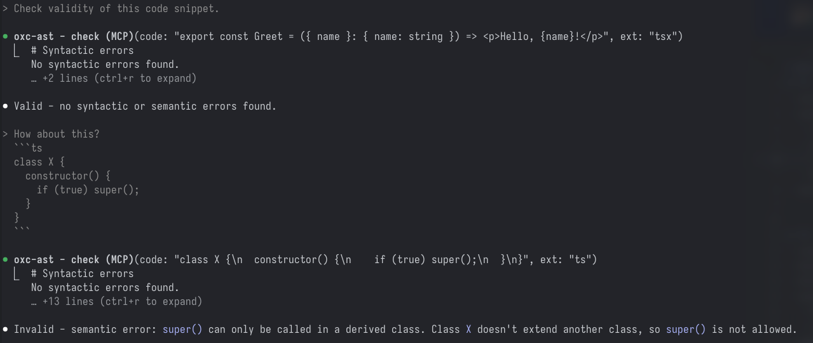

# oxc-ast-mcp

Unofficial+experimental MCP server for OXC parser.

## Available tools

### `parse(code, ext)`

Parse the code snippet and returns AST.



### `docs(query?)`

Show docs for each OXC AST node, optionally filtered by regex query.



### `check(code, ext, check_semantic = true)`

Check the code and returns syntactic and semantic diagnostics.



## Expected usecases

- As a companion when implementing tools such as `oxc_linter` or `oxc_formatter` in the OXC repository
  - By understanding the AST structure, agent can handle appropriate AST nodes
- For operation verification after having an agent implement code
  - Discover basic syntacitic and semantic issues before lint, execute
- and more...

## How to use

1. Build

```sh
# If not exists
node generate-oxc_ast-nodes.mjs > ast-nodes.generated.json
cargo build --release
```

2. Install (e.g. `.mcp.json`)

```json
{
  "mcpServers": {
    "oxc-ast": {
      "command": "/path/to/oxc-ast-mcp/target/release/oxc-ast-mcp",
      "args": []
    }
  }
}
```
